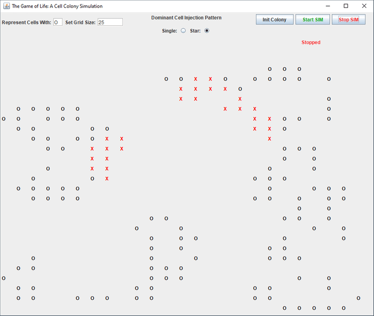

# Game of Life #
The Game of Life represents the life cycle of a colony of cells. Live cells 
are represented by the character 'O' on a grid, the size of which is set by 
the user. Each cell is randomly set to alive or dead, then displayed. The 
next generation is calculated by the count of a cell's live neighbors, the 
display updates, and so on.

## Requirements ##
* Java 11

## Installing ##
Download the latest release [here](https://github.com/lifeSource-Hub/GameOfLife/releases), then run the jar file.

This "fat jar" contains the necessary dependencies, all you need is Java 11.

## Built With ##
* Java
* Gradle

#### Screenshots: ####

